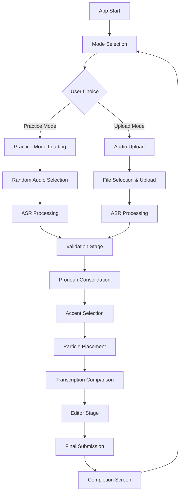
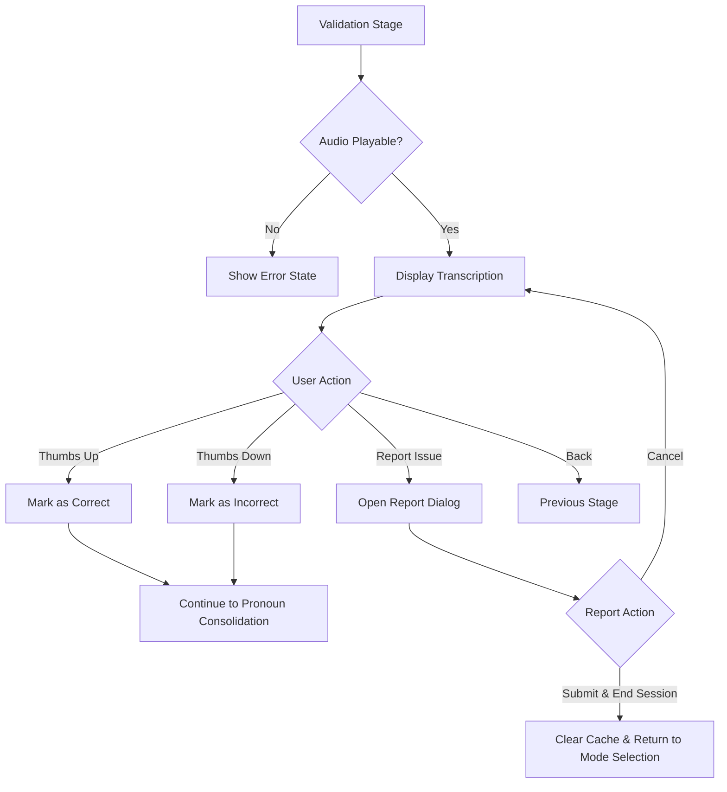
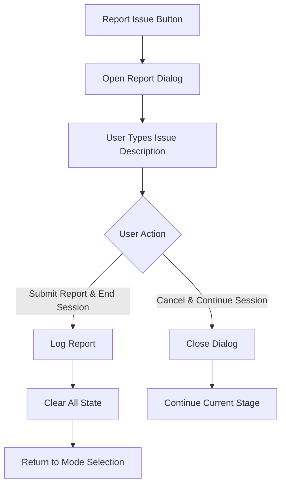
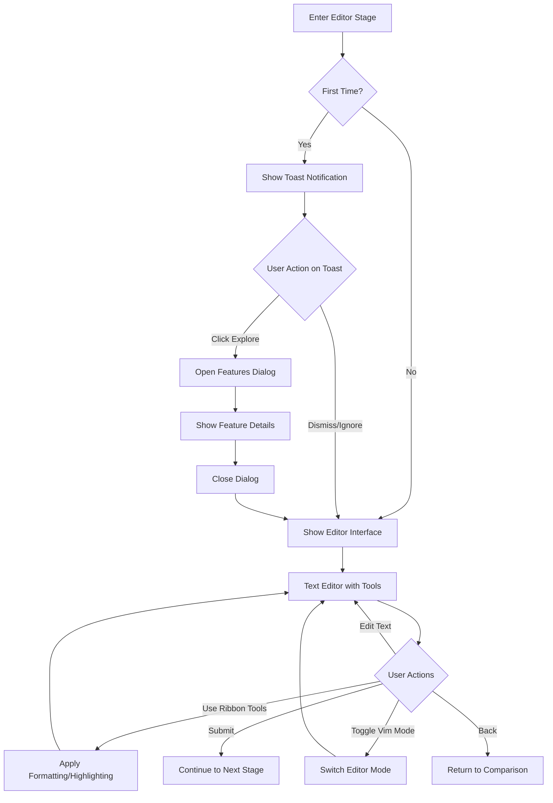
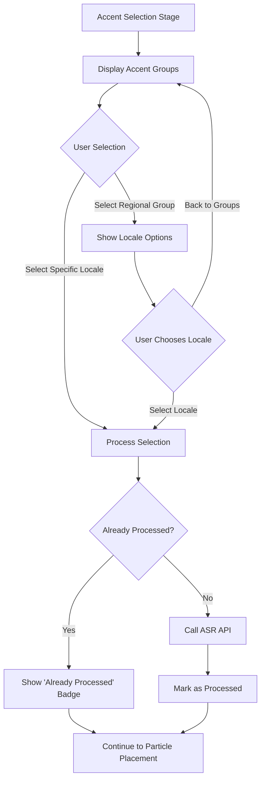
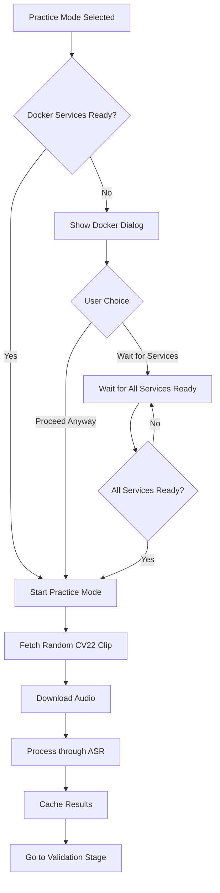
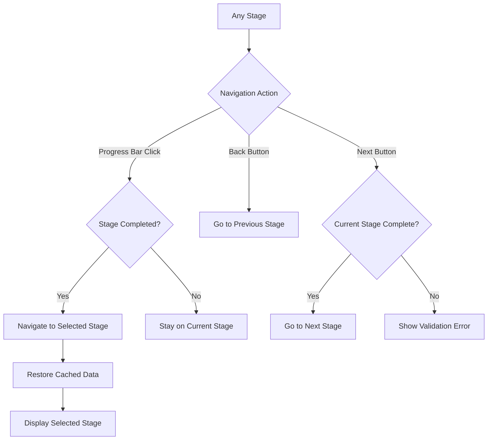
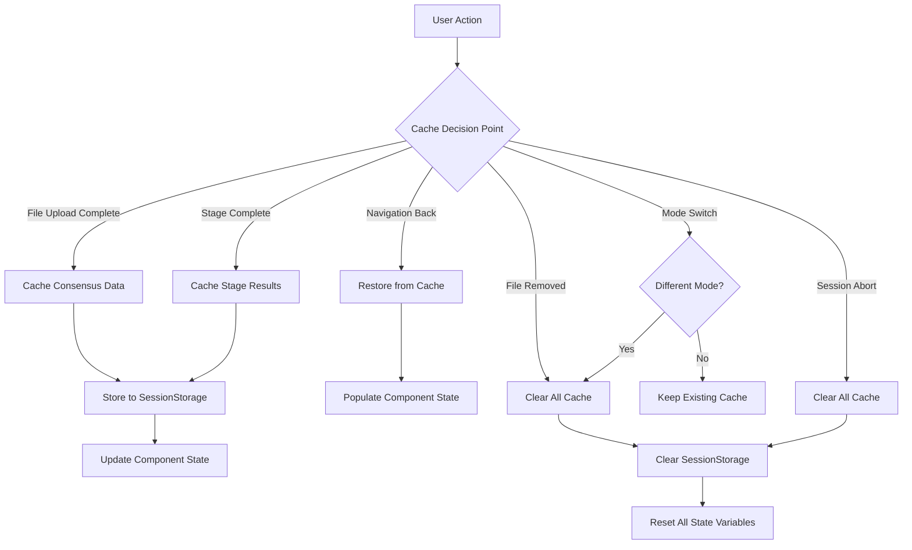
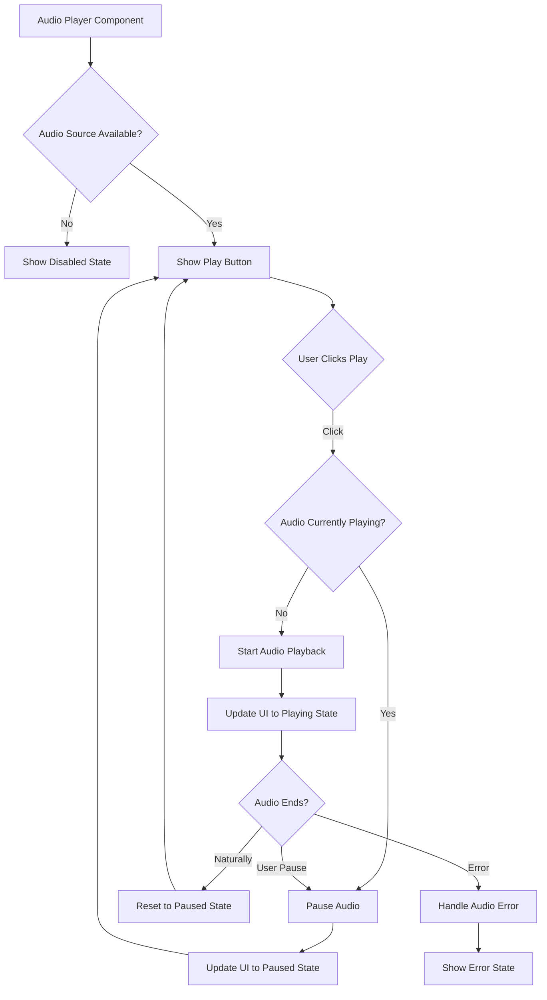
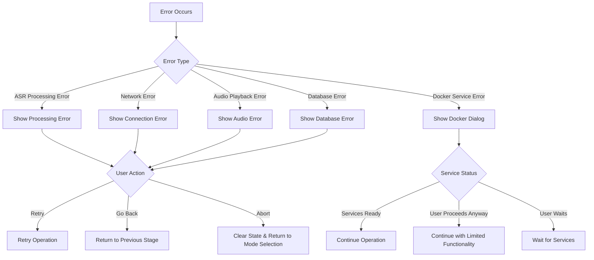

# Frontend Navigation Flowcharts

This document provides visual flowcharts for the Accentric frontend application navigation flows using Mermaid.js.

## 1. Main Application Flow

## 2. Validation Stage Decision Flow

## 3. Report Dialog Flow

## 4. Editor Stage Flow

## 5. Accent Selection Flow

## 6. Practice Mode Initialization Flow

## 7. Stage Navigation Flow

## 8. Cache Management Flow

## 9. Audio Playback Flow

## 10. Error Handling Flow

---

*These flowcharts represent the current navigation structure of the Accentric frontend application. They show the decision points, user interactions, and system responses throughout the application workflow.*