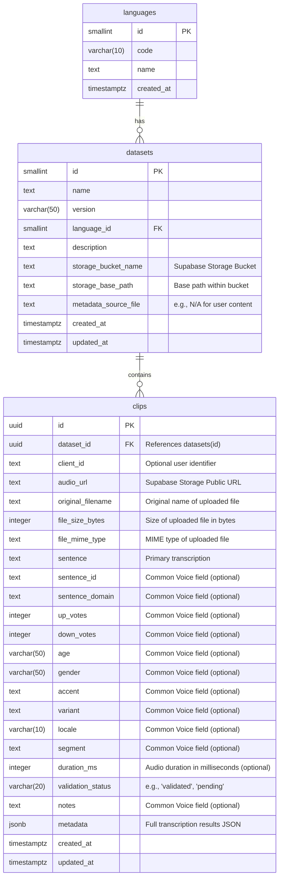

# Supabase Integration for User-Generated Content

This document outlines the Supabase database schema and setup instructions for storing user-uploaded audio files and their associated transcription metadata.

## Entity-Relationship Diagram (ERD)



## Database Schema (SQL DDL)

Run these SQL commands in your Supabase project's SQL Editor.

```sql
-- 1. Languages table (if not already exists)
CREATE TABLE IF NOT EXISTS languages (
  id smallint GENERATED ALWAYS AS IDENTITY PRIMARY KEY,
  code varchar(10) NOT NULL UNIQUE,
  name text,
  created_at timestamptz DEFAULT now()
);

-- Insert English language if not present
INSERT INTO languages (code, name) VALUES ('en', 'English') ON CONFLICT (code) DO NOTHING;

-- 2. Datasets table (if not already exists)
CREATE TABLE IF NOT EXISTS datasets (
  id uuid DEFAULT gen_random_uuid() PRIMARY KEY,
  name text NOT NULL,
  version varchar(50),
  language_id smallint REFERENCES languages(id),
  description text,
  storage_bucket_name text NOT NULL, -- Renamed from gcs_bucket_name
  storage_base_path text NOT NULL,    -- Renamed from gcs_base_path
  metadata_source_file text,
  created_at timestamptz DEFAULT now(),
  updated_at timestamptz DEFAULT now()
);

-- 3. Clips table (with new fields for user-generated content)
CREATE TABLE IF NOT EXISTS clips (
  id uuid DEFAULT gen_random_uuid() PRIMARY KEY,
  dataset_id uuid REFERENCES datasets(id) ON DELETE CASCADE,
  client_id text,
  audio_url text NOT NULL, -- Renamed from gcs_filename
  original_filename text,  -- New field
  file_size_bytes integer, -- New field
  file_mime_type text,     -- New field
  sentence text,
  sentence_id text,
  sentence_domain text,
  up_votes integer DEFAULT 0,
  down_votes integer DEFAULT 0,
  age varchar(50),
  gender varchar(50),
  accent text,
  variant text,
  locale varchar(10),
  segment text,
  duration_ms integer,
  validation_status varchar(20) DEFAULT 'validated',
  notes text,
  metadata jsonb, -- Stores the full JSON response from the ASR orchestration
  created_at timestamptz DEFAULT now(),
  updated_at timestamptz DEFAULT now(),
  UNIQUE(dataset_id, audio_url) -- Unique constraint updated
);

-- 4. Create indexes for performance (if not already exists)
CREATE INDEX IF NOT EXISTS idx_clips_dataset_id ON clips(dataset_id);
CREATE INDEX IF NOT EXISTS idx_clips_client_id ON clips(client_id);
CREATE INDEX IF NOT EXISTS idx_clips_locale ON clips(locale);
CREATE INDEX IF NOT EXISTS idx_clips_accent ON clips(accent);
CREATE INDEX IF NOT EXISTS idx_clips_sentence_fts ON clips USING gin(to_tsvector('english', sentence));
CREATE INDEX IF NOT EXISTS idx_clips_validation_status ON clips(validation_status);
```

## Supabase Setup Instructions

Follow these steps to prepare your Supabase project for user-generated content.

### Step 1: Create a Dataset Entry for User-Generated Content

This step creates a specific entry in your `datasets` table to categorize user-uploaded audio and their transcriptions.

1.  **Run the following SQL query in your Supabase SQL Editor:**

    ```sql
    INSERT INTO datasets (name, description, storage_bucket_name, storage_base_path, metadata_source_file)
    VALUES (
      'user_generated_transcriptions',
      'Transcriptions generated by users through the application',
      'user-audio-uploads', -- This should match your Supabase Storage bucket name
      'user_uploads',       -- This is a logical base path within the bucket
      'N/A'                 -- Not applicable for user-generated content
    )
    RETURNING id;
    ```

2.  **Copy the `id` (UUID) that is returned by this query.** You will need it in the next step.

### Step 2: Update `orchestrator.py` with the Dataset ID

Replace the placeholder `a_placeholder_dataset_id` in your `backend/src/orchestrator.py` file with the actual `id` you obtained from Step 1.

```bash
# Replace YOUR_ACTUAL_DATASET_ID_HERE with the UUID you copied
replace(file_path = "/home/laughdiemeh/FYP_HERE_WE_FKN_GO/backend/src/orchestrator.py", old_string = "\"dataset_id\": \"a_placeholder_dataset_id\",", new_string = "\"dataset_id\": \"YOUR_ACTUAL_DATASET_ID_HERE\",")
```

### Step 3: Create the Supabase Storage Bucket

1.  Go to your Supabase project dashboard.
2.  Navigate to **Storage** in the left sidebar.
3.  Click on **New bucket**.
4.  Set the **Name** to `user-audio-uploads`.
5.  You can choose to make it public or private based on your application's needs. For this setup, it's assumed to be public for direct access from the frontend, but you can configure RLS for private access if required.

## Data Flow Summary

1.  **Frontend Upload:** User uploads an audio file via `AudioUpload.tsx`.
2.  **Supabase Storage:** The frontend directly uploads the audio file to the `user-audio-uploads` bucket in Supabase Storage.
3.  **Backend Request:** The frontend sends a request to the backend's `/transcribe-consensus` endpoint, providing the public URL of the uploaded audio file, its original filename, size, and MIME type.
4.  **Backend Processing:** The backend downloads the audio from the provided URL, processes it through the ASR models, and generates the transcription results.
5.  **Supabase PostgreSQL Storage:** The backend then inserts a new record into the `clips` table, linking it to the `user_generated_transcriptions` dataset. The `audio_url` (Supabase Storage URL), `original_filename`, `file_size_bytes`, `file_mime_type`, primary `sentence` (transcription), and the full JSON `metadata` (containing all detailed results) are stored.

## Future Considerations

*   **Row Level Security (RLS):** Implement RLS policies on your `clips` table to control access to user-generated data, ensuring users can only view/manage their own content.
*   **Data Export:** Develop a mechanism (e.g., a Supabase Function, a backend endpoint) to export the `clips` data in the Common Voice 22 (CV22) schema format, leveraging the `metadata` JSONB column for detailed information.
*   **User Authentication:** Integrate Supabase Auth to associate `client_id` with actual authenticated users.
