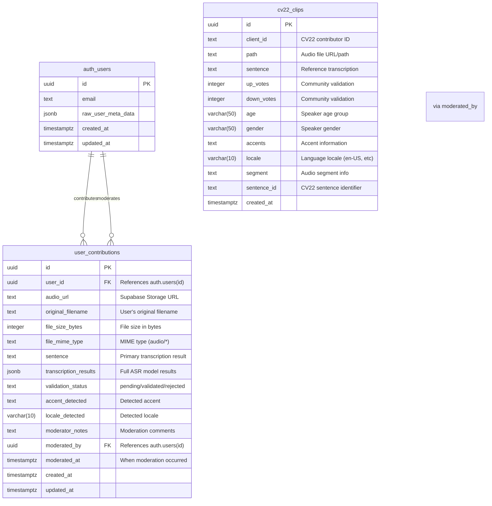

# Supabase Integration for Accentric FYP

This document outlines the Supabase database schema, storage configuration, and setup instructions for the Accentric ASR transcription application with dual-path data architecture.

## Architecture Overview

The system implements a **dual-path data architecture** to separate concerns and maintain data integrity:

1. **Practice Mode Path**: Read-only Common Voice 22 (CV22) compatible dataset for user practice
2. **Contribution Mode Path**: Read-write user contributions with moderation workflow

This separation ensures:
- Clean practice data (no risk of malicious content)
- CV22 export compatibility
- Scalable moderation workflow
- Clear data lineage and quality control

## Entity-Relationship Diagram (ERD)



## ERD Design Justification

### Why Two Separate Tables?

**`cv22_clips` Table:**
- **Purpose**: Read-only practice dataset with validated Common Voice data
- **Schema**: Exact CV22 field compatibility for seamless export
- **Access Pattern**: Random read queries for practice mode
- **Data Source**: Pre-validated Common Voice dataset imports

**`user_contributions` Table:**
- **Purpose**: User-generated content with app-specific workflow
- **Schema**: App-optimized with moderation fields and ASR metadata
- **Access Pattern**: Write-heavy for contributions, filtered reads for moderation
- **Data Source**: Frontend uploads via Supabase Storage

### Key Design Decisions:

1. **Separate Practice/Contribution Paths**: Prevents data contamination and allows different validation workflows
2. **Direct auth.users Reference**: Leverages Supabase Auth for user management
3. **JSONB for ASR Results**: Flexible storage for varying model outputs
4. **Validation Status Enum**: Clear moderation workflow states
5. **Storage URL References**: Direct Supabase Storage integration
6. **Moderation Audit Trail**: Track who performed moderation actions and when for research integrity

## Storage Bucket Architecture

### Bucket Configuration

**`user-contributions` Bucket:**
- **Purpose**: User-uploaded audio files awaiting moderation
- **Access**: Public read (for frontend playback), authenticated write
- **File Types**: audio/wav, audio/mp3, audio/mp4, audio/webm
- **Size Limit**: 50MB per file
- **Retention**: Permanent (until moderated and validated)

**`validated-clips` Bucket:**
- **Purpose**: Approved audio files for practice mode and export
- **Access**: Public read
- **Data Source**: CV22 imports + validated user contributions
- **Organization**: Folder structure by locale/accent for efficient serving

## Database Schema (SQL DDL)

### Core Tables Creation

```sql
-- Enable UUID extension
CREATE EXTENSION IF NOT EXISTS "uuid-ossp";

-- Practice Mode: CV22-Compatible Dataset (Read-Only)
CREATE TABLE cv22_clips (
  id uuid PRIMARY KEY DEFAULT uuid_generate_v4(),
  
  -- CV22 Standard Fields
  client_id text,                    -- Original contributor ID from CV22
  path text,                        -- Audio file URL/path
  sentence text NOT NULL,           -- Reference transcription
  up_votes integer DEFAULT 0,       -- Community validation votes
  down_votes integer DEFAULT 0,     -- Community validation votes
  age varchar(50),                  -- Speaker age group (teens, twenties, etc.)
  gender varchar(50),               -- Speaker gender
  accents text,                     -- Accent information
  locale varchar(10),               -- Language locale (en-US, es-ES, etc.)
  segment text,                     -- Audio segment information
  sentence_id text,                 -- CV22 sentence identifier
  
  -- Internal Fields
  created_at timestamptz DEFAULT now()
);

-- User Contributions: App-Specific Workflow (Read-Write)
CREATE TABLE user_contributions (
  id uuid PRIMARY KEY DEFAULT uuid_generate_v4(),
  
  -- User Association
  user_id uuid REFERENCES auth.users(id) ON DELETE SET NULL,
  
  -- Audio File Metadata
  audio_url text NOT NULL,          -- Supabase Storage public URL
  original_filename text,           -- User's original filename
  file_size_bytes integer,          -- File size in bytes
  file_mime_type text,              -- MIME type validation
  
  -- Transcription Data
  sentence text,                    -- Primary transcription result
  transcription_results jsonb,      -- Full ASR model outputs and metadata
  
  -- Workflow Management
  validation_status text DEFAULT 'pending' 
    CHECK (validation_status IN ('pending', 'validated', 'rejected')),
  moderator_notes text,             -- Moderation comments and feedback
  
  -- Moderation Audit Trail
  moderated_by uuid REFERENCES auth.users(id) ON DELETE SET NULL,
  moderated_at timestamptz,         -- When moderation action occurred
  
  -- Detected Metadata (for CV22 export mapping)
  accent_detected text,             -- Detected accent information
  locale_detected varchar(10),      -- Detected language locale
  
  -- Timestamps
  created_at timestamptz DEFAULT now(),
  updated_at timestamptz DEFAULT now()
);

-- Performance Indexes
CREATE INDEX idx_cv22_clips_sentence ON cv22_clips(sentence);
CREATE INDEX idx_cv22_clips_locale ON cv22_clips(locale);
CREATE INDEX idx_cv22_clips_accents ON cv22_clips(accents);

CREATE INDEX idx_user_contributions_status ON user_contributions(validation_status);
CREATE INDEX idx_user_contributions_user ON user_contributions(user_id);
CREATE INDEX idx_user_contributions_moderator ON user_contributions(moderated_by);
CREATE INDEX idx_user_contributions_created ON user_contributions(created_at DESC);
CREATE INDEX idx_user_contributions_moderated ON user_contributions(moderated_at DESC);

-- Full-text search on sentences
CREATE INDEX idx_cv22_clips_sentence_fts ON cv22_clips 
  USING gin(to_tsvector('english', sentence));
CREATE INDEX idx_user_contributions_sentence_fts ON user_contributions 
  USING gin(to_tsvector('english', sentence));

-- Auto-update timestamp trigger
CREATE OR REPLACE FUNCTION update_updated_at_column()
RETURNS TRIGGER AS $$
BEGIN
  NEW.updated_at = now();
  RETURN NEW;
END;
$$ language 'plpgsql';

CREATE TRIGGER update_user_contributions_updated_at 
  BEFORE UPDATE ON user_contributions 
  FOR EACH ROW EXECUTE FUNCTION update_updated_at_column();

-- Auto-update moderation timestamp when validation status changes
CREATE OR REPLACE FUNCTION update_moderation_timestamp()
RETURNS TRIGGER AS $$
BEGIN
  IF OLD.validation_status IS DISTINCT FROM NEW.validation_status AND 
     NEW.validation_status IN ('validated', 'rejected') THEN
    NEW.moderated_at = now();
  END IF;
  RETURN NEW;
END;
$$ language 'plpgsql';

CREATE TRIGGER update_user_contributions_moderation 
  BEFORE UPDATE ON user_contributions 
  FOR EACH ROW EXECUTE FUNCTION update_moderation_timestamp();
```

## Data Flow Integration

### Frontend-to-Database Mapping

**Practice Mode Flow:**
```typescript
// Frontend: Index.tsx:682-730
const randomClip = await supabase
  .from('cv22_clips')
  .select('id, sentence, path as audio_url')
  .limit(1)
  .single();

// Returns: { clip_id, sentence, audio_url, gcs_object_path_in_bucket }
```

**Upload Mode Flow:**
```typescript
// Frontend: AudioUpload.tsx:116-144
// 1. Upload to Supabase Storage
const { data } = await supabase.storage
  .from('user-contributions')
  .upload(filePath, file);

// 2. Store metadata (after ASR processing)
const { data } = await supabase
  .from('user_contributions')
  .insert({
    user_id: user.id,
    audio_url: publicUrl,
    original_filename: file.name,
    file_size_bytes: file.size,
    file_mime_type: file.type,
    sentence: asrResult.primary,
    transcription_results: asrResult
  });
```

### ASR Orchestrator Integration

**Current:** No database writes from orchestrator (separated concerns)
**Future:** Optional webhook to update transcription_results after ASR processing

## CV22 Export Compatibility

### Export Service Query

```sql
-- Generate CV22-compatible export combining both data paths
SELECT 
  -- From validated practice dataset
  client_id,
  path,
  sentence,
  up_votes,
  down_votes,
  age,
  gender,
  accents,
  locale,
  segment,
  sentence_id
FROM cv22_clips

UNION ALL

-- From validated user contributions (transformed to CV22 format)
SELECT 
  COALESCE(u.email, 'anonymous') as client_id,
  uc.audio_url as path,
  uc.sentence,
  0 as up_votes,
  0 as down_votes,
  NULL as age,
  NULL as gender,
  uc.accent_detected as accents,
  uc.locale_detected as locale,
  NULL as segment,
  uc.id::text as sentence_id
FROM user_contributions uc
LEFT JOIN auth.users u ON uc.user_id = u.id
WHERE uc.validation_status = 'validated';
```

### Export Formats

- **`clips.tsv`**: All clips (CV22 + validated contributions)
- **`validated.tsv`**: Only validated subset
- **`other.tsv`**: Pending/rejected contributions
- **`metadata.json`**: Export statistics and provenance

## Setup Instructions

### Step 1: Create Storage Buckets

1. Navigate to **Supabase Dashboard → Storage**
2. Create bucket: `user-contributions`
   - Public: ✅ (for frontend access)
   - File size limit: 50MB
   - Allowed MIME types: `audio/*`
3. Create bucket: `validated-clips`
   - Public: ✅ (for practice mode)
   - For CV22 and approved contributions

### Step 2: Run Database Schema

1. Go to **Supabase Dashboard → SQL Editor**
2. Create new query
3. Paste the complete SQL DDL from above
4. Execute to create tables and indexes

### Step 3: Configure Row Level Security (Optional)

```sql
-- Enable RLS on user_contributions
ALTER TABLE user_contributions ENABLE ROW LEVEL SECURITY;

-- Users can only see their own contributions
CREATE POLICY "Users can view own contributions" ON user_contributions
  FOR SELECT USING (auth.uid() = user_id);

-- Users can insert their own contributions
CREATE POLICY "Users can insert own contributions" ON user_contributions
  FOR INSERT WITH CHECK (auth.uid() = user_id);

-- cv22_clips is public read-only (no RLS needed)
```

### Step 4: Seed Practice Data (Optional)

```sql
-- Insert sample CV22 data for testing
INSERT INTO cv22_clips (client_id, path, sentence, locale, accents) VALUES
('sample_001', 'https://example.com/audio1.wav', 'The quick brown fox jumps over the lazy dog.', 'en-US', 'General American'),
('sample_002', 'https://example.com/audio2.wav', 'Pack my box with five dozen liquor jugs.', 'en-GB', 'Received Pronunciation'),
('sample_003', 'https://example.com/audio3.wav', 'How vexingly quick daft zebras jump!', 'en-AU', 'General Australian');
```

## Frontend Integration Changes

### Update AudioUpload.tsx Bucket Name

```typescript
// Line 116: Change bucket name for proper separation
const bucketName = "user-contributions"; // Instead of "user-audio-uploads"
```

### Implement Direct Practice Mode Query

```typescript
// Replace dockerAPI.getRandomClip() in Index.tsx:685
const { data: randomClip, error } = await supabase
  .from('cv22_clips')
  .select('id, sentence, path')
  .limit(1)
  .order('random()')
  .single();

if (error) throw error;

// Transform to expected format
const clip = {
  clip_id: randomClip.id,
  sentence: randomClip.sentence,
  audio_url: randomClip.path,
  gcs_object_path_in_bucket: randomClip.path
};
```

## Monitoring and Analytics

### Key Metrics Queries

```sql
-- User contribution statistics
SELECT 
  validation_status,
  COUNT(*) as count,
  AVG(file_size_bytes) as avg_file_size
FROM user_contributions 
GROUP BY validation_status;

-- Practice mode usage
SELECT 
  DATE(created_at) as date,
  COUNT(*) as clips_served
FROM cv22_clips 
GROUP BY DATE(created_at)
ORDER BY date DESC;

-- Top contributing users
SELECT 
  u.email,
  COUNT(*) as contributions,
  COUNT(*) FILTER (WHERE uc.validation_status = 'validated') as validated
FROM user_contributions uc
JOIN auth.users u ON uc.user_id = u.id
GROUP BY u.email
ORDER BY contributions DESC;

-- Moderation activity tracking
SELECT 
  m.email as moderator,
  COUNT(*) as total_moderated,
  COUNT(*) FILTER (WHERE uc.validation_status = 'validated') as approved,
  COUNT(*) FILTER (WHERE uc.validation_status = 'rejected') as rejected,
  AVG(EXTRACT(EPOCH FROM (uc.moderated_at - uc.created_at))/3600) as avg_hours_to_moderate
FROM user_contributions uc
JOIN auth.users m ON uc.moderated_by = m.id
WHERE uc.moderated_at IS NOT NULL
GROUP BY m.email
ORDER BY total_moderated DESC;

-- Moderation queue (pending items)
SELECT 
  uc.id,
  uc.original_filename,
  uc.sentence,
  u.email as contributor,
  uc.created_at,
  EXTRACT(EPOCH FROM (now() - uc.created_at))/3600 as hours_pending
FROM user_contributions uc
JOIN auth.users u ON uc.user_id = u.id
WHERE uc.validation_status = 'pending'
ORDER BY uc.created_at ASC;
```

## Future Enhancements

1. **Automatic Moderation**: Integrate content filtering APIs
2. **Quality Scoring**: Implement automated audio quality assessment
3. **Accent Detection**: Add ML-based accent classification
4. **Community Validation**: Implement crowd-sourced validation workflow
5. **Advanced Analytics**: Add dashboard for contribution and usage metrics
6. **Multi-language Support**: Extend schema for multiple language datasets
7. **Incremental Export**: Implement delta exports for large datasets

## Security Considerations

- **File Upload Validation**: Verify MIME types and scan for malicious content
- **Rate Limiting**: Implement upload quotas per user
- **Storage Quotas**: Monitor and limit storage usage per user
- **Content Moderation**: Review flagged content before validation
- **Data Privacy**: Ensure GDPR compliance for user data handling
- **Access Control**: Use RLS for fine-grained permissions

This architecture provides a robust foundation for the Accentric FYP while maintaining flexibility for future enhancements and research requirements.